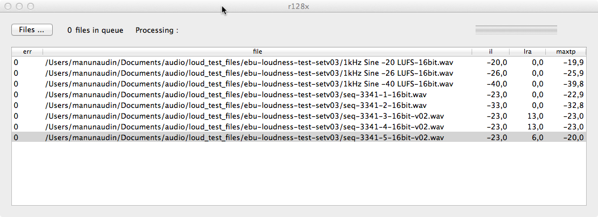

# r128x, a command line tool for loudness measurement of files on Mac OSX Intel. #
# with gui now !
#

## Binaries ##
r128x-cli https://www.dropbox.com/s/iqiv96ngwhufwby/r128x-cli-0-2.zip

r128x-gui https://www.dropbox.com/s/2r1ypokkc23wj2y/r128x-gui-0-2.zip
 
v 0.2 2013-04-13
(voir version Française plus bas)
## Description ##
r128x is a command line tool for measuring Integrated Loudness, Loudness range and Maximum True Peak of audio files on the Mac OS X system with an Intel processor.

It uses libebeur128 (https://github.com/jiixyj/libebur128) for the Integrated Loudness and Loudness Range measures.

It uses CoreAudio's AudioConverter service to oversample audio data and obtain the Maximum True Peak.

It uses CoreAudio ExtAudioFile's service to read the samples from an audio file.

## Installation ##
You can build the executable from the Xcode project, or use the provided executable.

Just drag the executable file to your hard drive.
/usr/local/bin/ should be a nice place to put the binary if you want it to be in your $PATH.

## Usage ##
r128x /some/audio/file.wav
Will print out the full file path, the Integrated Loudness in LUFS, the Loudness range in LU, the Maximum True Peak in dBTP.
Will print an error message in case of unsupported file or if an error occurs during processing.

## Issues ##
Channel mapping is static, using the default libebur128 channel mapping :
L / R / C / LFE / Ls / Rs.
You will have incorrect results if your file's channels mapping is different.
As r128x uses CoreAudio to read audio files, only file formats/codecs supported by CoreAudio are supported by r128x.

# r128x, une application en ligne de commande pour les mesures de Loudness de fichiers audio sur Mac OS X Intel. #
v 0.1 16/09/2012
## Description ##
r128x est une application en ligne de commande pour la mesure du Loudness Intégré, du Loudness range et du Maximum True Peak de fichiers audio sur Mac OS X avec processeur Intel.

Elle utilise la bibliothèque libebur128 (https://github.com/jiixyj/libebur128) pour les mesures de Loudness Intégré et de Loudness Range.

Elle utilise le service AudioConverter de CoreAudio pour le sur-échantillonage nécessaire à la mesure du Maximum True Peak.

Elle utilise le service ExtAudioFile de CoreAudio pour la lecture des échantillons audio d'un fichier.

## Installation ##
Vous pouvez compiler l'exécutable depuis le projet Xcode, ou utiliser l'exécutable fourni.

Il suffit de faire glisser l'exécutable sur votre disque dur.

/usr/local/bin/ peut être un bon choix de répertoire de destination si vous voulez que l'exécutable soit dans votre $PATH.

## Utilisation ##
r128x /chemin/vers/unfichier.wav
affichera le chemin complet du fichier, son Loundess Intégré en LUFS, son Loudness Range en LU et son Maximum True Peak en dBTP.
affichera un message d'erreur si le fichier n'est pas pris en charge ou qu'une erreur s'est produite durant l'analyse.

## Problèmes ##
La configuration des canaux audio est statique et utilise la configuration par défaut de libebur128 : L / R / C / LFE / Ls / Rs.

Les résultats seront incorrects si la configuration des canaux audio de votre fichier est différente.

Étant donné que r128x utilise CoreAudio pour lire les fichiers audio, seuls les formats/codecs pris en charge par CoreAudio sont pris en charge par r128x.
